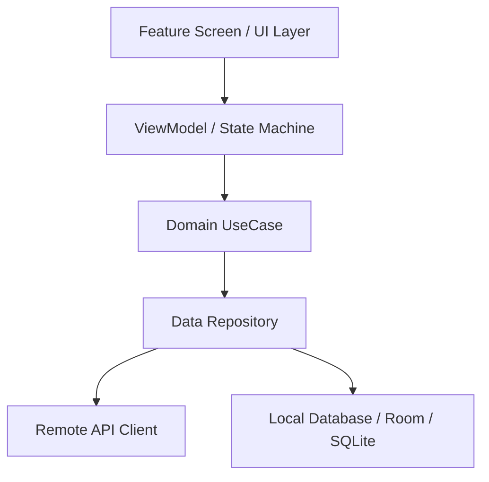

# Graphify Codebase Knowledge Graph

Fast, deterministic structural code intelligence for AI coding agents. Enables instant mapping of symbol dependencies, cross-module blast radius, and call hierarchies without full-text grep scans.

---

## When to Use

1. **Architecture Discovery**: Exploring a large unfamiliar codebase (e.g. `remoot_android_studio`, `motapos-app`, `zed-custom`).
2. **Blast Radius Analysis**: Finding every file and caller that will break if an API, DTO, or ViewModel contract changes.
3. **Cross-Module Refactoring**: Deciding clean boundary seams between feature modules, core libraries, and presentation layers.
4. **Token Conservation**: Replacing 20 repeated `grep`/`read` cycles with a single structured relationship trace.

---

## The Graphify Workflow

```
   ┌───────────────┐     ┌───────────────┐     ┌───────────────┐
   │ 1. MAP ROOT   │ ──► │ 2. TRACE SEAMS│ ──► │ 3. BLAST ZONE │
   │ (Modules/Deps)│     │ (Core APIs)   │     │ (Callers/Refs)│
   └───────────────┘     └───────────────┘     └───────────────┘
```

### Step 1: Map Project Topology
Identify modules, build files, and architectural boundaries:
- **Android**: Root `settings.gradle.kts` → module `:app`, `:core:network`, `:feature:geniesmart`.
- **Flutter**: `pubspec.yaml` → packages, feature sub-directories.
- **Rust**: Root `Cargo.toml` `[workspace.members]` → crates relationship.

### Step 2: Extract Dependency & Call Graph
For any symbol under inspection (class, interface, struct, endpoint):
1. **Definition**: Where is the canonical declaration?
2. **Inbound References (Callers)**: Who depends on this symbol?
   - In Rust/C++: Use LSP `references` or `grep` on exact qualified names.
   - In Kotlin: Check ViewModel → UseCase → Repository → API Service.
   - In Flutter: Check Widget → Bloc/Notifier → Repository.
3. **Outbound Dependencies**: What does this symbol touch?

### Step 3: Emit Visual Architecture Map
When explaining complex module interactions to the user, emit a clean Mermaid or ASCII dependency graph:



### Step 4: Blast-Radius Checklist
Before applying breaking refactors:
- [ ] List all callers across all modules.
- [ ] Confirm no circular dependencies are introduced.
- [ ] Check if shared DTO changes affect persistent database schemas.
- [ ] Verify if tests exist for all affected inbound callsites.
